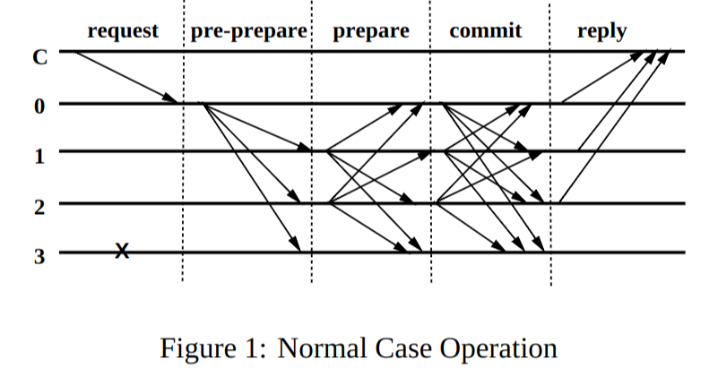

# PBFT Paper Reading 

*Practical Byzantine Fault Tolerance*

这篇论文提出了一种可以实际使用的BFT设计，该设计并不依赖同步假设，并且论文中所实现的系统，支持1RTT的只读请求，以及2RTT的读写混合请求。并且可以、容忍 \\( \lfloor \frac{n + 1}{3} \rfloor \\) 的恶意节点。

论文分成了如下部分：

1. 第一个在异步网络中使用的BFT状态复制机协议
2. 描述了一些关于状态复制机的优化方向
3. 一个 BFT NFS 的概要设计
4. 一些实验结果和实验设计

关于实验的设计和结果，这里就不展开解释了，可以去读原论文。

## 系统模型

系统模型建立在异步的分布式系统之上，并且节点使用网络相互连接，而朴素BFT则是假设所有的节点本质是一个进程，也就是只有IPC，没有RPC。那么对于网络连接的分布式系统来说，丢包，重传，重复都是非常常见的情况。

同样在这个系统中，不仅仅存在可靠的节点，同样存在恶意节点，为了避免消息的伪造以及消息的重放，同时为了探测系内无效的消息。每个节点都会使用自己的公钥来签名消息，由此给出了如下的形式化定义：

节点 \\( i \\) 对消息 \\( m \\) 签名得到 \\( {\langle m \rangle}_{\sigma i} \\)， 并且数字签名形式化的定义为 \\( D(m) \\)。

然后假设系统内存在一个强大的对手，可以协调大量的节点伪造，重放消息，但是论文假设了这个对手的计算速度有限，无法在有限的事件内伪造诚实节点的消息。

## 服务属性

1. 共识服务并不局限在提供一次性的读写服务，而是给客户端提供执行任意操作的机会，简单来说就是混合读写的操作。
2. 对于客户端来说，发布请求到这个共识服务，然后就会阻塞在这个共识服务上等待返回。
3. 共识服务在\\( n \\) 个备份的情况下，最多能容忍\\( \lfloor \frac{n + 1}{3} \rfloor \\) 的恶意节点。
4. 安全性意味着，在同一时间，服务只会原子的执行一个操作，就好像中心化服务器一样。
5. 服务并不关心有多少个错误的客户端，因为3pc可以保证错误的外部消息不会被执行。
6. 服务并不能抵御，正确的消息，但是操作是错误的情况，比如正确的客户端上传一个超出整个系统承载力的文件，因此论文就使用了认证来解决这个问题，类似账户密码一样。而在ETH中就直接通过Gas来解决这个问题。
7. 服务的正确性工作在异步网络，所以活性必然要通过同步的假设来解决。

## 算法描述

### 客户端

### 普通操作

普通操作其实就是系统对客户端暴露的接口，从外部来调用这个共识服务，而共识服务内部的系统接口，会在下面的垃圾回收和视图变更部分详细描述。

### 垃圾回收

### 视图变更

*TODO: Raft Paxos 的 Term 变更从这个地方来的，需要做一个详细的对比*

### 正确性

#### 安全性

#### 活性

### 不确定性

## 优化

### 减少不必要的沟通

### 密码学优化

## PBFT NFS 的设计

### 状态复制算法库

### NFS 架构

### 保持检查点

### 计算检查点签名